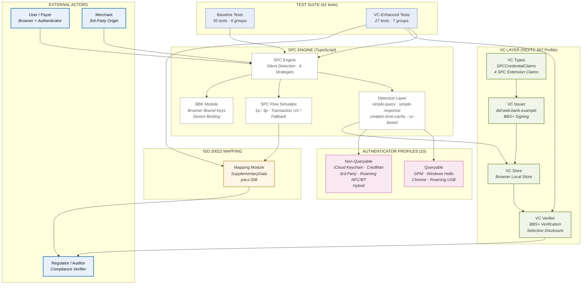

# SPC Non-Queryable Authenticator: Scored Analysis

**Author:** Olvis E. Gil Ríos — Invited Expert, W3C Web Payments Working Group  
**Date:** September 8, 2026  
**Test Results:** 62/62 passed (35 SPC baseline + 27 VC-enhanced)

## Overview

This repository contains a Node.js/TypeScript test suite that simulates the Secure Payment Confirmation (SPC) specification's "as-yet undefined" silent-detection algorithms across **four strategies**, ten authenticator profiles, and both of Stephen McGruer's proposed specification changes. It also includes a **VC-enhanced detection strategy** that integrates the author's ISO/TC 307 VC compliance profile (BBS+ selective disclosure, ISO 20022 SupplementaryData mapping) with the SPC engine.

### The Problem

The current SPC design excludes non-queryable authenticators (CredMan, iCloud Keychain, third-party providers, unconnected roaming keys) from the transaction UX path. The browser cannot silently determine whether a credential exists or whether it supports third-party payment, because these authenticators don't support CTAP silent queries.

### The Solution

The **VC-enhanced approach** replaces the authenticator-stored CTAP `thirdPartyPayment` bit with a portable, cryptographically verifiable VC claim. The VC is issued at credential registration time and stored locally in the browser. During SPC authentication, the browser verifies the VC's BBS+ signature instead of querying the authenticator — eliminating the non-queryable problem entirely.

## Scoring Summary

| Approach | Score (max 70) |
|---|---|
| Current SPC | 27/70 |
| Proposal 1 (Partitioned Lists) | 38/70 |
| Proposal 2 (`alwaysShowTransactionDialog`) | 32/70 |
| P1 + P2 Combined | 45/70 |
| P1 + P2 + BBK | 48/70 |
| **VC-Enhanced + BBK** | **70/70** |

## Architecture Diagram



**Legend:** Blue = external actors · Gray = SPC core engine · Green = VC layer (BBS+ / ISO TC 307) · Orange = ISO 20022 mapping · Pink = authenticator profiles · Light blue = test suite

## Repository Structure

```
spc-research/
├── src/
│   ├── types.ts                        # Core interfaces (credentials, challenges, results)
│   ├── authenticators/
│   │   └── registry.ts                 # 10 simulated authenticator profiles
│   ├── rp/
│   │   └── server.ts                    # Mock RP server (challenge, register, verify)
│   ├── spc/
│   │   └── engine.ts                    # SPC engine with 4 detection strategies
│   ├── vc/
│   │   ├── types.ts                     # SPC-specific VC claim schema
│   │   └── issuer.ts                    # BBS+ issuer/verifier/VC store
│   ├── iso20022/
│   │   └── mapping.ts                  # ISO 20022 SupplementaryData/pacs.008 mapping
│   └── tests/
│       ├── spc.test.ts                  # 35 baseline tests
│       └── vc-enhanced.test.ts          # 27 VC-enhanced tests
├── REPORT.md                            # Full scored analysis report
├── REPORT.tex                           # LaTeX source
├── REPORT.pdf                           # Compiled PDF (18 pages)
├── package.json
├── tsconfig.json
└── vitest.config.ts
```

## Authenticator Profiles Simulated

| Authenticator | Platform | Queryable | 3P Bit | Silent Listing | Connected |
|---|---|---|---|---|---|
| GPM (direct API) | Android | ✅ | ✅ | ✅ | ✅ |
| Windows Hello (Win 11) | Windows | ✅ | ✅ | ✅ | ✅ |
| iCloud Keychain | macOS | ❌ | ❌ | ❌ | ✅ |
| Chrome internal | macOS | ✅ | ❌ | ✅ | ✅ |
| CredMan | Android | ❌ | ❌ | ❌ | ✅ |
| Third-party provider | macOS | ❌ | ❌ | ❌ | ✅ |
| Roaming USB | Windows | ✅ | ✅ | ✅ | ❌ |
| Roaming NFC | Android | ❌ | ✅ | ❌ | ❌ |
| Roaming Bluetooth | Windows | ❌ | ✅ | ❌ | ❌ |
| Hybrid (cross-device) | Android | ❌ | ❌ | ❌ | ❌ |

## Detection Strategies

1. **`simple-query`** — Browser queries the authenticator via CTAP (works only for queryable, connected authenticators)
2. **`simple-response`** — Browser sends a minimal CTAP response (same limitations)
3. **`creation-time-cache`** — Browser caches credential metadata at creation time (doesn't scale across browsers)
4. **`vc-based`** — Browser verifies a locally-stored VC with BBS+ signature (works for ALL authenticator types)

## Test Groups

| Group | Tests | Description |
|---|---|---|
| Silent Detection Strategies | 10 | Each detection strategy vs. queryable/non-queryable/disconnected |
| Current SPC Behavior (Baseline) | 7 | Current SPC UX flow for each authenticator scenario |
| Proposal 1: Partitioned Credential Lists | 5 | Fallback UX with "Use passkey" option |
| Proposal 2: `alwaysShowTransactionDialog` | 4 | Opt-in forced transaction UX |
| Browser Bound Keys (BBK) | 3 | BBK creation, reuse, and RP verification |
| Edge Cases | 6 | Issue #273, cross-browser cache, hybrid, cross-border |
| VC-Based Detection Strategy | 6 | VC detection for all 10 authenticator types, 3p authorization |
| VC-Enhanced SPC Flow | 4 | 3p case unblocked for non-queryable authenticators |
| BBS+ Selective Disclosure | 5 | Privacy-preserving claim revelation for merchants vs. regulators |
| ISO 20022 Mapping | 5 | SupplementaryData/pacs.008 mapping, field validation |
| VC + BBK Combined Flow | 3 | Device binding + VC, assurance level escalation |
| Cross-Border with VC | 2 | EU→LatAm with roaming key, issue #273 solved via VC |
| VC Revocation | 2 | W3C Status List 2021 revocation mechanism |
| **Total** | **62** | |

## Key Findings

- **Finding 1:** Current SPC excludes 7 of 10 authenticator types from transaction UX
- **Finding 2:** Creation-time cache does not scale across browsers
- **Finding 3:** Issue #273 — third-party payment bit silently lost on non-supporting authenticators
- **Finding 4:** Proposal 1 works for 1p case but is blocked for 3p
- **Finding 5:** Proposal 2 enables transaction UX but risks "cannot proceed"
- **Finding 6:** BBK creation and reuse works correctly
- **Finding 7:** Cross-border scenario highlights the gap
- **Finding 8:** VC-based detection works for ALL authenticator types (including non-queryable)
- **Finding 9:** VC solves issue #273 — third-party payment bit preserved via VC
- **Finding 10:** BBS+ selective disclosure preserves WebAuthn privacy model
- **Finding 11:** VC + BBK enables graduated assurance levels for ISO 20022
- **Finding 12:** 3p case fully unblocked with VC-based detection

## Getting Started

### Prerequisites

- Node.js 18+
- npm

### Installation

```bash
npm install
```

### Run Tests

```bash
npm test
```

### Generate JSON Report

```bash
npm run test:report
```

Results are written to `results.json`.

### Build

```bash
npm run build
```

## VC-Enhanced Approach

The VC-enhanced detection strategy adds 4 new claims to the author's existing ISO/TC 307 VC compliance profile:

- `thirdPartyPayment` — Replaces the CTAP bit (solves issue #273)
- `authenticatorAssuranceLevel` — Maps to ISO 20022 `AssrncLvl`
- `deviceBound` — Indicates BBK binding status
- `bbkPublicKey` — Device-binding public key

### BBS+ Selective Disclosure

The browser creates a Verifiable Presentation revealing only the claims needed by the verifier:
- **Merchants** see: `thirdPartyPayment`, `rpId`, `credentialId`
- **Regulators** see: `amlRiskCategory`, `legalPersonIdentifier`, `assuranceLevel`

### ISO 20022 Mapping

SPC authentication evidence maps to ISO 20022 `SupplementaryData/ComplianceEvidence`:
- `thirdPartyPayment` → `AuthntcnTp` (authentication type)
- `deviceBound` → `SctyPt` (security point)
- `assuranceLevel` → `AssrncLvl` (assurance level)
- `authenticatorType` → `AuthntcnMtd` (authentication method)

### Revocation

VCs include W3C Status List 2021 for credential authorization lifecycle management.

## Report

The full scored analysis report is available in three formats:
- **[REPORT.md](REPORT.md)** — Markdown
- **[REPORT.pdf](REPORT.pdf)** — PDF (18 pages)
- **[REPORT.tex](REPORT.tex)** — LaTeX source

## References

- [Non-queryable authenticators explainer](https://github.com/w3c/secure-payment-confirmation/blob/main/explainers/non-queryable-authenticators.md) — Stephen McGruer
- [Authenticators and SPC](https://github.com/w3c/secure-payment-confirmation/blob/main/explorations/authenticators-and-spc.md) — Stephen McGruer & Ian Jacobs
- [SPC Specification (Editor's Draft)](https://w3c.github.io/secure-payment-confirmation/)
- [Issue #273: Third-party payment bit loss](https://github.com/w3c/secure-payment-confirmation/issues/273)
- [Issue #271: BBK proposal](https://github.com/w3c/secure-payment-confirmation/issues/271)
- [W3C Verifiable Credentials Data Model v2.0](https://www.w3.org/TR/vc-data-model-2.0/)
- [W3C Status List 2021](https://www.w3.org/TR/vc-status-list-2021/)
- [BBS Cryptosuites](https://www.w3.org/TR/vc-di-bbs/)

## License

MIT

## Author

**Olvis E. Gil Ríos**  
Invited Expert, W3C Web Payments Working Group  
Member, W3C Verifiable Credentials Working Group  
ISO/TC 307 Contributor  
[GitHub](https://github.com/Olvisgil)
